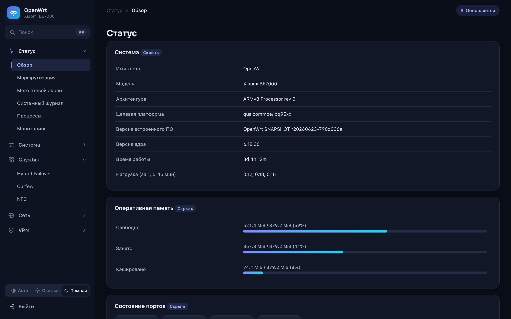

# OpenWrt для Xiaomi BE7000 (ядро 6.18, без kexec)

Сборка свежего OpenWrt из main для Xiaomi BE7000 (плата RC06, процессор IPQ9554). Система грузится прямо с флеша, сток остаётся в соседнем слоте, так что вернуться на него можно в любой момент. За основу взят порт kravasuper (ветка xiaomi_be7000, коммит 790d036a). К нему я добавил три исправления в драйвер Ethernet, без которых на моей плате система вообще не доходила до сети.

Текущая версия 1.2.3. Образы лежат в Releases, проверяйте суммы по sha256sums.txt. Что изменилось после 1.1, описано ниже в разделе про версии.

## Зачем это

Образ из порта на моей плате не запускался. Диод быстро мигает белым, ни сети, ни Wi-Fi, а через четыре включения питания загрузчик возвращает сток. В обсуждении порта такое описывают не только у меня, и обычно списывают на ревизии платы. UART на плате 1.8 В и адаптера под него у меня не было, поэтому причину искал по логам, которые сама прошивка пишет во флеш (как это сделано, ниже).

Оказалось, что запуск ломают три ошибки, которые цепляются друг за друга.

Первая в драйвере PHY QCA8084. Он сразу после настройки ждёт линк BaseR 100 мс и при неудаче возвращает ошибку. Но линк зависит от сигнала, который посылает процессор, а процессор начинает его слать только когда порт открывают. Если загрузчик успел настроить SerDes, проверка проходит. У меня не проходила, и в логе было `BaseR link failed!` и `PPE port 1 failed to connect phylink`. Исправление (патч 0901) превращает ошибку в предупреждение.

Вторая в qcom-ppe. После той ошибки драйвер разбирает себя и вызывает `napi_disable()` для NAPI, который уже выключен. Такой вызов не возвращается никогда. `insmod` застревает, а поскольку модули грузит `S10boot`, дальше не стартует вообще ничего, ни сеть, ни SSH, ни Wi-Fi. Это патч 0900.

Третья там же. Если убрать зависание, в очистке порта индекс `i` уходит в минус, и код читает память перед началом массива. Получается oops. Это патч 0902.

Два последних патча исправляют настоящие баги драйвера и не зависят от платы, их стоит отправить в ядро. Первый обходной, правильнее было бы настраивать SerDes процессора до подключения PHY.

## Что проверено

Проверял на одном экземпляре, RC06, IPQ9554 rev 1.1, стоковая прошивка 1.1.38, 1 ГБ памяти.

Система загружается за 25 секунд и доходит до LuCI и SSH. Гигабитный порт даёт около 940 Мбит/с в обе стороны по iperf3, ошибок CRC и потерь нет. Wi-Fi 2.4 и 5 ГГц работают как Wi-Fi 6, калибровка из раздела ART подхватывается, правка TLMM6 и TLMM7 для 5 ГГц применена. WireGuard и AmneziaWG (модуль и утилита awg собраны под это ядро) загружаются.

Wi-Fi 7 в режиме точки доступа на самом деле работает. Раньше я дважды писал, что не работает, ошибался оба раза. Сначала принял побочный эффект своих же экспериментов за ограничение драйвера, потом решил, что дело в MLO на уровне ядра. По факту причина была куда банальнее, у интерфейса точки доступа была отдельная настройка disabled, не совпадающая с настройкой самого радио, и в паре прогонов она осталась включённой по недосмотру. На чистой перезагрузке, без единой правки в системных скриптах, EHT80 поднимается и с фиксированным каналом, и с автовыбором. Проверил не только на уровне hostapd, но и по-настоящему, подключил ноутбук, macOS показывает PHY Mode 802.11be, канал 36 на 80 МГц, iperf3 даёт 945 Мбит/с, сигнал минус 27 дБм. Автовыбор канала на 5 ГГц тоже работает нормально.

Позже, когда роутер встал на место старого, проверил и остальное. PPPoE на живой линии работает. sysupgrade из самого OpenWrt тоже работает, настройки переезжают, и с версии 1.2 вместе с ними переезжает список включённых служб. Порты на 2.5 Гбит/с проверены другим владельцем, линк поднимается на 2500 Мбит/с, через порт прошло 72 ГБ в одну сторону и 30 в другую без единой ошибки. Если выставить страну RU, прошивка радиомодуля QCN9274 сама запрещает 802.11be (в iw reg get появляется NO-EHT на всех диапазонах), и EHT80 не поднимается, это решение прошивки, а не драйвера. 
## Слоты флеша

Загрузчик Xiaomi держит две копии прошивки. Слот 0 это раздел rootfs (mtd23), слот 1 это rootfs_1 (mtd24), по 40 МиБ. Флаги выбора слота лежат в mtd17 (APPSBLENV), переключаются через nvram на стоке и fw_setenv в OpenWrt. Загрузчик (0:APPSBL и 0:APPSBL_1) не трогайте ни при каких условиях, это единственное место, где плату можно убить насовсем.

Образ пишется в неактивный слот, тот, где сток сейчас не работает. Какой это слот, скрипт определяет сам.

Про sysupgrade. В версиях 1.0 и 1.1 он всегда писал в rootfs_1, и у тех, чей сток лежал именно там, обновление его стирало. С версии 1.2 слот определяется из строки ядра, которую заполняет загрузчик, обновляется тот слот, откуда система загрузилась, а соседний не трогается никогда. Если слот определить не удалось, прошивка не начинается вовсе.

Обновляться можно и через LuCI, раздел Система, Backup / Flash Firmware. Внутри он вызывает тот же sysupgrade, поэтому слот выбирается так же правильно.

## Установка

Сначала про версию стока. Обе удачные установки со стока делались с 1.1.38. Двое, у кого после установки ничего не поднялось, сидели на 1.1.16 и на 1.1.7. Причина пока не понятна: загрузчик с обновлением стока не меняется, в файле прошивки 1.1.38 только root.ubi и номер версии, я проверил. Обновить сток до 1.1.38 перед установкой всё равно стоит, вреда от этого нет.

Нужен root по SSH на стоке, например через xmir-patcher. Пароль root там задаётся отдельно, пункт 8, Other functions, пароль от веб-интерфейса для SSH не подходит. Перед прошивкой снимите бэкап разделов ART (mtd20, там калибровка Wi-Fi), bdata (mtd25, MAC-адреса и серийник), APPSBLENV (mtd17), обоих загрузчиков и обоих слотов. Без ART радио не заработают. Снять можно так, для каждого раздела отдельно.

```
ssh -o HostKeyAlgorithms=+ssh-rsa root@192.168.31.1 "cat /dev/mtd20" > mtd20_ART.bin
```

Дальше заливаем образ и скрипт, сверяем сумму и запускаем.

```
ssh -o HostKeyAlgorithms=+ssh-rsa root@192.168.31.1 "cat > /tmp/openwrt.ubi" < openwrt-qualcommbe-ipq95xx-xiaomi_be7000-squashfs-factory.ubi
ssh -o HostKeyAlgorithms=+ssh-rsa root@192.168.31.1 "cat > /tmp/install.sh" < scripts/install-from-stock.sh
ssh -o HostKeyAlgorithms=+ssh-rsa root@192.168.31.1 "openssl dgst -sha256 /tmp/openwrt.ubi"
ssh -o HostKeyAlgorithms=+ssh-rsa root@192.168.31.1 "sh /tmp/install.sh /tmp/openwrt.ubi reboot"
```

Сумму из третьей команды сверьте с sha256sums.txt до запуска четвёртой. Скрипт смотрит, из какого слота работает сток, сверяет это с флагом загрузки, пишет образ в другой слот через ubiformat и переключает флаги.

После загрузки роутер отвечает на 192.168.1.1, пароль root пустой, Wi-Fi выключен. Wi-Fi я отключил специально, потому что порт по умолчанию поднимает открытую сеть BE7000. Включите его в LuCI и сразу задайте пароль root. Если подключаетесь с Mac, адрес адаптеру задавайте вручную и без шлюза. Иначе macOS отправит весь трафик в роутер, у которого ещё нет интернета.

Проверить, что всё встало как надо, можно так.

```
cat /tmp/sysinfo/board_name
dmesg | grep -E "BaseR|Link is Up|probe with driver"
fw_printenv flag_boot_rootfs flag_last_success flag_boot_success
```

Вместо `BaseR link failed` должно быть `BaseR link not up yet, continuing`, а дальше `Link is Up` на портах.

Если роутер после установки не отозвался, первым делом проверьте адрес на компьютере. Частая ошибка это задать компьютеру тот же адрес, что у роутера. Тогда два устройства спорят за один адрес, и не работает ничего, включая ping и сканеры сети. Нужен соседний адрес, 192.168.1.2 для OpenWrt и 192.168.31.2 для стока, маска 255.255.255.0, шлюз пустой.

Сравнивать раздел с образом через `mtd verify` после установки бесполезно, хеши не сойдутся и на исправной флешке. ubiformat раскладывает данные по своей структуре и пишет служебные заголовки со счётчиками стираний, побайтово с файлом образа раздел не совпадёт никогда.


## Откат

Из работающего OpenWrt запустите scripts/rollback-to-stock.sh и перезагрузитесь, он переключает флаги на другой слот. Если система не загружается, загрузчик вернёт сток сам, но не сразу: на седьмом включении питания, с паузой секунд в тридцать после каждого. В более ранней версии этого текста стояло «четыре раза», это было неверно. Если и это не помогло, остаётся TFTP-режим загрузчика Xiaomi.

Как это устроено, стоит знать, потому что нигде не описано. Я разобрал стоковый U-Boot (cmd_bootmiwifi.c в дампе APPSBL). flag_boot_rootfs он не читает вовсе, только записывает обратно. При flag_ota_reboot=0 грузится слот из flag_last_success, а счётчик flag_try_sys{N}_failed для этого слота увеличивается на каждой загрузке, безусловно. Переключение на другой слот, когда счётчик больше 5. Обнулить его может только загрузившаяся система, сток это делает у себя в init. При flag_ota_reboot=1 и flag_boot_success не равном нулю грузится другой слот, не last_success, а flag_boot_success сбрасывается в 0. Если та загрузка не подтвердилась, следующая же возвращает last_success. Это и есть путь штатного OTA.

Установщик до 1.2.2 переводил flag_last_success на новый слот и обнулял счётчики. Работало, но откат наступал только на седьмом включении, а в инструкции было четыре. С 1.2.3 установщик идёт по пути OTA: last_success остаётся на стоке, flag_ota_reboot=1, и если OpenWrt не поднялась, следующее включение возвращает сток. Подтверждает загрузку сама OpenWrt службой be7000-bootconfirm в самом конце старта: переводит last_success на свой слот, снимает ota_reboot и обнуляет счётчики.

Отсюда же следствие для всех, кто на 1.0 - 1.2.2: счётчик растёт с каждой перезагрузкой, и на седьмой роутер уходит в сток. Пока не обновились, поставьте службу руками:

```
wget -O /etc/init.d/be7000-bootconfirm https://raw.githubusercontent.com/timofey-maykov/be7000-openwrt/main/overlay-files/etc/init.d/be7000-bootconfirm
chmod +x /etc/init.d/be7000-bootconfirm && /etc/init.d/be7000-bootconfirm enable && /etc/init.d/be7000-bootconfirm start
```

## Что в образе

OpenWrt SNAPSHOT r20260623-790d036a, ядро 6.18.36, архитектура aarch64_cortex-a73, пакеты apk. Фиды зафиксированы на ту же дату (feeds-pins.txt). Точный список пакетов лежит в файле manifest, конфиг сборки в config.buildinfo.

Из заметного: модуль qcom-ppe с ускорением PPE, firewall4 и nftables, PPPoE, dnsmasq-full, WireGuard и AmneziaWG, tc и ifb для шейпинга, драйверы ath11k (2.4 ГГц) и ath12k (5 ГГц) с прошивками, полный wpad, LuCI с https и русским языком, поддержка USB-накопителей, iperf3. Пакета kmod-ath11k-ahb в профиле порта не было, я его добавил. Без него встроенный радиомодуль 2.4 ГГц остаётся без драйвера.

Служба be7000-secure-defaults выключает оба радио при первой загрузке. Исходник лежит в overlay-files.

Пакеты ставятся из коробки. Официальное зеркало собирает qualcommbe под cortex-a53, а эта сборка идёт под cortex-a73, поэтому каталога aarch64_cortex-a73 на зеркале нет вовсе и все общие фиды отдают 404. В образ прописан свой фид, собранный из того же дерева и подписанный ключом, которому образ уже доверяет, так что --allow-untrusted не нужен. После apk update доступно 658 пакетов, включая nano, htop, tcpdump, strace, tmux, rsync, jq, modemmanager с драйверами USB-модемов, ksmbd и ttyd. Модули ядра лежат в отдельном фиде, потому что на зеркале они собраны под 6.18.52 и зависимость по версии ядра не удовлетворят.

## Место под настройки и пакеты

Внутри слота под rootfs_data остаётся около 8 МБ, и этого мало. Начиная с 1.2 система при первой загрузке забирает под /overlay отдельный раздел флеша на 28 МБ, где заводская прошивка держит свои настройки. Свободного места становится 19.4 МБ вместо 7.4.

Цена в том, что настройки стока при этом стираются. Сам сток загружается и работает, но приходит в заводское состояние. Если это не нужно, поставьте в /etc/config/bigoverlay значение 0 до первой загрузки.

Если места нужно больше, есть команда be7000-extroot, она переносит /overlay на внешний диск целиком.

```
be7000-extroot list
be7000-extroot use /dev/sda1 --yes
be7000-extroot status
be7000-extroot revert --yes
```

Она отказывается работать с примонтированным диском и с внутренней флешью, форматирует только после --yes, переносит текущий оверлей и прописывает fstab по UUID. В LuCI то же самое на странице Система, Накопитель.

Отдельно она отсеивает разделы, у которых смонтирован диск целиком. После смены таблицы разделов ядро продолжает показывать старые узлы вроде /dev/sda1, хотя файловая система теперь занимает весь диск, и форматирование такого узла затёрло бы живые данные.

## Тема оформления

Для LuCI сделал свою тему Nimbus. В ней меню слева, быстрый поиск по страницам, светлая и тёмная схема, и она нормально выглядит на телефоне. Исходники, скриншоты и инструкция по установке лежат в папке [luci-theme-nimbus](luci-theme-nimbus), готовый пакет есть в релизах. Тема не привязана к BE7000 и ставится на любой OpenWrt с LuCI 23.05 и новее.



## Сборка

Собирал в Docker на debian bookworm, исходники держал в томе Docker, а не на диске macOS (там регистронезависимая файловая система теряет файлы ядра). Порядок такой.

Берёте дерево kravasuper/openwrt на коммите 790d036a и фиды на дату из feeds-pins.txt. Кладёте три патча из patches в target/linux/qualcommbe/patches-6.18. В DTS платы добавляете два gpio-hog для TLMM6 (выход в ноль) и TLMM7 (выход в единицу), они нужны для нормального приёма на 5 ГГц. В профиль устройства добавляете kmod-ath11k-ahb. Подключаете фид awg-feed для AmneziaWG. Создаёте в корне дерева файл version с содержимым r20260623-790d036a, без него apk не соберёт base-files, потому что в тарболе нет .git. Копируете overlay-files в files. Выбираете в конфиге xiaomi_be7000, wpad-mbedtls вместо wpad-basic, luci-ssl и остальное по своему вкусу. После make defconfig обязательно проверьте grep-ом, что нужные драйверы остались включёнными. Потом make world.

Перед прошивкой проверьте список пакетов, чтобы не потерять драйвер так же, как я потерял ath11k при первой сборке.

```
grep -E "^(kmod-ath11k-ahb|kmod-ath12k|kmod-qcom-ppe|wpad-mbedtls|luci-ssl) " *.manifest
```

Образы можно разобрать и посмотреть состав скриптом scripts/ubi_extract.py (том 1 это squashfs).

## Как искать причину без UART

Про метод, потому что он пригодится не только здесь. Сначала образ пишется в неактивный слот со стока, так что стоковая загрузка остаётся запасной. В образ добавляется служба, которая каждую секунду сохраняет dmesg и список процессов во флеш, причём для каждой загрузки в свою папку. Это важно. У меня первые выводы были неверными как раз потому, что при включениях питания новая загрузка затирала данные предыдущей, и я принимал моменты обрыва питания за зависание.

Потом со стока подключается том rootfs_data слота (ubiattach и cat из /dev/ubiN_M), файл разбирается на компьютере утилитой ubireader, потому что стоковое ядро UBIFS со сжатием zstd не монтирует. Когда система начинает доходить до сети, поток из /dev/kmsg по SSH на компьютер показывает панику ядра в реальном времени. С работающего OpenWrt вернуться на сток можно через fw_setenv и reboot без выключения питания. Драйверы-модули удобно проверять без прошивки, отправив ko по SSH и запустив insmod.

## Docker

Пакеты докера собираются отдельно, на раннерах GitHub. Причина простая: OpenWrt собирает dockerd, containerd и runc через Go, а golang-bootstrap отказывается ставиться на хост linux/arm64, и на машине, где обычно собирается эта прошивка, они не собираются в принципе. Workflow лежит в .github/workflows/docker-feed.yml, он же собирает rclone, zerotier и dnscrypt-proxy2 по той же причине.

Ставится одной командой. Главное, что она делает, это выбирает, куда положить данные: по умолчанию dockerd пишет в /opt/docker, то есть в 19 МБ оверлея, и первый же образ их забьёт.

```
be7000-docker status
be7000-docker setup --yes
be7000-docker setup --data-root /mnt/usb/docker --yes
```

Без аргументов она сама ищет смонтированный диск, где свободно хотя бы гигабайт, и прописывает data-root туда.

Управление разделено на две части, потому что дублировать готовое смысла нет.

Контейнеры, образы, сети и тома по отдельности живут в **Сервисы, Dockerman**. Там создание контейнера со всеми полями, включая порты, тома, переменные, устройства, лимиты памяти и процессора, а также логи, статистика и веб-консоль внутрь контейнера.

Стеки compose, готовые наборы и уборка мусора лежат в **Сервисы, Docker: стеки**. Там редактор docker-compose.yml прямо в браузере, запуск и остановка, обновление образов, журнал, и готовые стеки в одно нажатие: Portainer, AdGuard Home, Uptime Kuma, Vaultwarden, qBittorrent, Nginx Proxy Manager, Home Assistant и Watchtower. Каждый готовый стек можно открыть и поправить до разворачивания.

## Как собирается

Руками больше ничего не собирается. Всё делает один workflow в `.github/workflows/build.yml` на GitHub Actions.

Запуск по кнопке (Actions, Build, Run workflow) собирает все пакеты из `config.buildinfo`, подписывает индексы ключом из секрета `APK_SIGNING_KEY` и пушит фид в ветку gh-pages. Пуш тега `v1.2.3` или `v1.3-r20261001` делает то же самое и вдобавок собирает прошивку, кладёт в архив установщик с инструкцией, считает суммы и создаёт Release с приложенными файлами. Через артефакты Actions ничего не проходит, только git и Release.

Модули ядра публикуются в каталог с хешем конфига ядра, `feed/targets/qualcommbe/ipq95xx/<хеш>/packages/`. Образ при сборке вписывает свой хеш в `customfeeds.list`, поэтому старые образы продолжают находить модули, которые к ним подходят, когда конфиг ядра меняется. Каталог без хеша это фид образов 1.2.x, workflow его не трогает.

Текст для релиза берётся из `docs/release-notes/<тег>.md`, если такой файл есть, иначе GitHub сгенерирует его из коммитов.

## Версии

**1.2.3**, 24 сентября 2026. Обновиться стоит всем. Загрузчик Xiaomi увеличивает счётчик попыток на каждой загрузке и после седьмой переключает слот, а сбросить его может только загрузившаяся система. В образах до 1.2.2 этого никто не делал, поэтому роутер после семи перезагрузок молча уходил в сток. Добавлена служба be7000-bootconfirm, которая в конце старта обнуляет счётчики и отмечает свой слот рабочим. Установщик со стока теперь идёт по пути штатного OTA (flag_ota_reboot=1, flag_last_success остаётся на стоке), и если OpenWrt не поднялась, следующее же включение возвращает сток, ждать семь включений не нужно. В инструкцию добавлен шаг про пароль root в xmir-patcher и раздел про адрес компьютера.

**1.2.2**, 24 сентября 2026. Радио больше не выключается при обновлении. Служба, которая гасит его при первой загрузке, запоминала это меткой в /etc, а метка не переносилась при sysupgrade, поэтому каждое обновление выглядело для неё чистой установкой.

**1.2.1**, 24 сентября 2026. Страница Накопитель в разделе Система. В 1.2 она по ошибке оказалась внутри приложения hybrid-failover, которого в публичном образе нет, поэтому у людей её не было.

**1.2**, 24 сентября 2026. sysupgrade пишет в тот слот, из которого загрузились, и не трогает соседний со стоком. Службы, включённые руками, переживают обновление. /overlay переехал на отдельный раздел, 19.4 МБ вместо 7.4. Появилась команда be7000-extroot. Прописан свой фид пакетов, apk update даёт 658 пакетов вместо неработающих 404.

**1.1**, 22 сентября 2026. Тема LuCI Nimbus по умолчанию, UPnP со страницей в LuCI и модули nft_tproxy.

**1.0**, 22 сентября 2026. Первая публичная сборка с тремя исправлениями драйвера Ethernet.

## Ограничения

Места под /overlay 19.4 МБ, для чего-то крупного лучше вынести его на USB командой be7000-extroot. Ядро использует мейнлайновый qcom-ppe, а не вендорный NSS, так что ускорение только на уровне PPE. Порт отстаёт от main примерно на 1350 коммитов, при обновлении могут понадобиться правки патчей.

## Лицензия

Патчи в patches распространяются на условиях GPL-2.0-only, как ядро Linux. Скрипты и текст можно использовать как угодно. Образы собраны из исходников OpenWrt, порта kravasuper, этих патчей и пакетов из awg-feed, версии и конфиг указаны в config.buildinfo и feeds-pins.txt.

## Спасибо

kravasuper за сам порт, а всем, кто писал в обсуждении про TLMM и XPCS, за подсказки.
