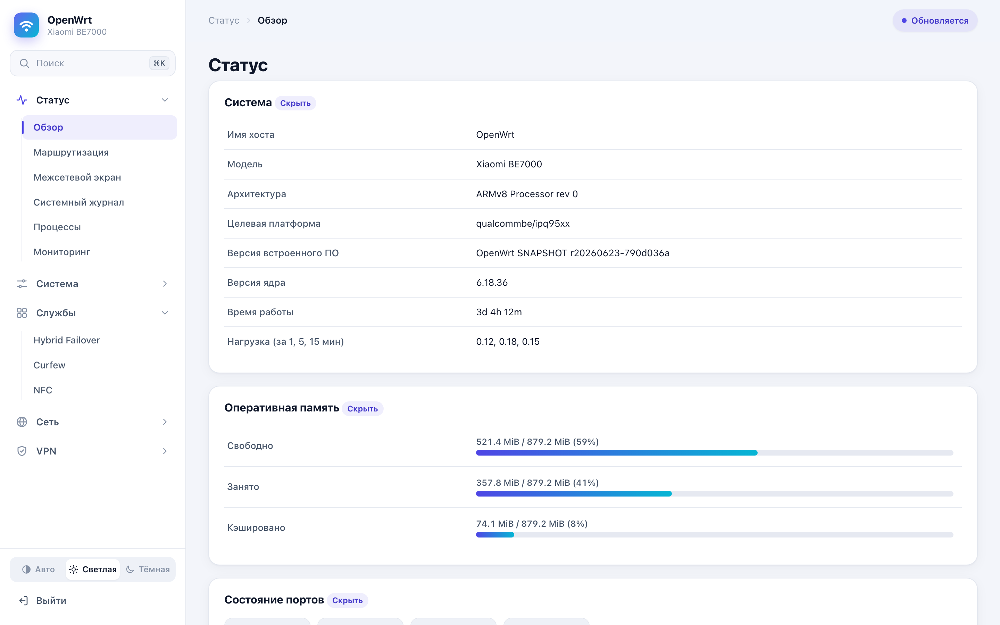
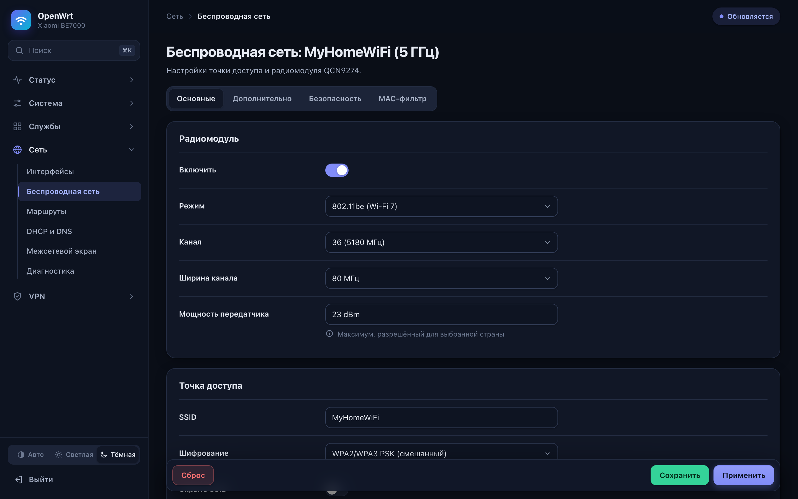
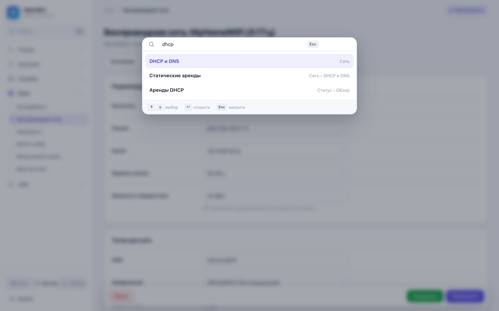
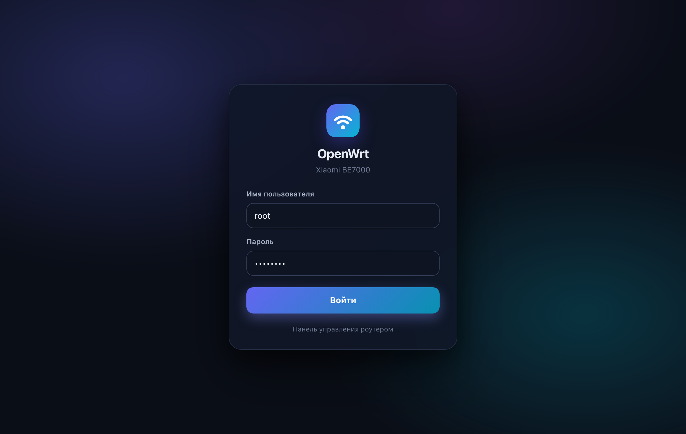
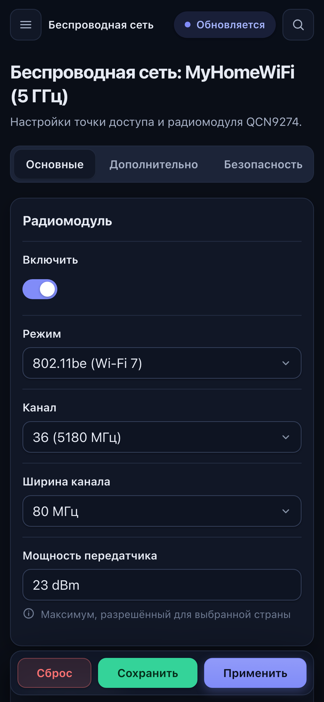

# Nimbus, тема LuCI

Современная тема для веб-интерфейса OpenWrt. Делал её для своей сборки под Xiaomi BE7000, но от железа она не зависит и встанет на любой OpenWrt с LuCI на ucode (23.05 и новее).


## Что в ней

- Меню слева по разделам, текущий раздел раскрыт и подсвечен. Какие разделы раскрыты, тема запоминает.
- Быстрый переход к любой странице по `⌘K` или `Ctrl K`, а также по клавише `/`. Ищет и по названиям вкладок.
- Светлая, тёмная и автоматическая схема, переключатель внизу меню. Выбор хранится в браузере.
- Кнопки Сохранить и Применить всегда видны внизу экрана, не нужно листать длинную страницу до конца.
- Флажки в виде переключателей, аккуратные поля, выпадающие списки, вкладки и всплывающие окна.
- На телефоне меню выезжает сбоку, таблицы превращаются в карточки, поля растягиваются на всю ширину.
- Новая страница входа.
- Переменные цветов совместимы с темой Bootstrap, поэтому сторонние приложения LuCI выглядят нормально без правок.

| Светлая | Wi-Fi |
|---|---|
|  |  |

| Поиск | Вход | Телефон |
|---|---|---|
|  |  |  |

На скриншотах демонстрационные данные, имена и адреса вымышленные.

## Установка готовым пакетом

Этот способ для OpenWrt с менеджером пакетов apk (снапшоты и 25.x). Пакет не содержит бинарников, так что архитектура роутера неважна.

1. Скачайте `luci-theme-nimbus_*.apk` со страницы [релизов](https://github.com/timofey-maykov/be7000-openwrt/releases).

2. Скопируйте его на роутер. Ключ `-O` нужен потому, что на OpenWrt нет sftp-сервера.

```sh
scp -O luci-theme-nimbus_*.apk root@192.168.1.1:/tmp/
```

3. Установите по SSH.

```sh
apk add --allow-untrusted --no-network /tmp/luci-theme-nimbus_*.apk
rm /tmp/luci-theme-nimbus_*.apk
```

`--allow-untrusted` нужен потому, что пакет подписан моим ключом сборки, а не ключом OpenWrt. После установки тема сразу становится основной.

4. Откройте LuCI и обновите страницу с очисткой кеша (`Cmd+Shift+R` на Mac, `Ctrl+F5` на Windows и Linux).

## Установка без менеджера пакетов

Подходит для любой версии, в том числе с opkg. Скачайте репозиторий и из его корня выполните

```sh
cd luci-theme-nimbus
scp -O -r htdocs/luci-static/nimbus root@192.168.1.1:/www/luci-static/
scp -O htdocs/luci-static/resources/menu-nimbus.js root@192.168.1.1:/www/luci-static/resources/
scp -O -r ucode/template/themes/nimbus root@192.168.1.1:/usr/share/ucode/luci/template/themes/
ssh root@192.168.1.1 'uci set luci.themes.Nimbus=/luci-static/nimbus; uci set luci.main.mediaurlbase=/luci-static/nimbus; uci commit luci'
```

Файлы, скопированные вручную, при обновлении прошивки через sysupgrade пропадут, после него повторите команды. Пакет или сборка в образ этой проблемы не имеют.

## Сборка в свою прошивку

Положите папку `luci-theme-nimbus` в `package/` дерева OpenWrt, в котором подключён фид luci, и включите пакет.

```sh
cp -r luci-theme-nimbus ~/openwrt/package/
cd ~/openwrt
echo "CONFIG_PACKAGE_luci-theme-nimbus=y" >> .config
make defconfig
make package/luci-theme-nimbus/compile
```

Для полного образа дальше как обычно `make world`. При первой загрузке тема сама станет основной.

## Как вернуть старую тему

В LuCI откройте Система, затем Система, вкладку Язык и оформление, и выберите другую тему. Или по SSH

```sh
uci set luci.main.mediaurlbase=/luci-static/bootstrap
uci commit luci
```

Удалить пакет можно командой `apk del luci-theme-nimbus`.

## Если что-то выглядит не так

Почти всегда виноват кеш браузера, обновите страницу с очисткой кеша. Если какая-то страница стороннего приложения всё равно отображается криво, напишите в issues, какое приложение и что именно не так, лучше со скриншотом.

## Лицензия

Apache-2.0, как и сама LuCI.
